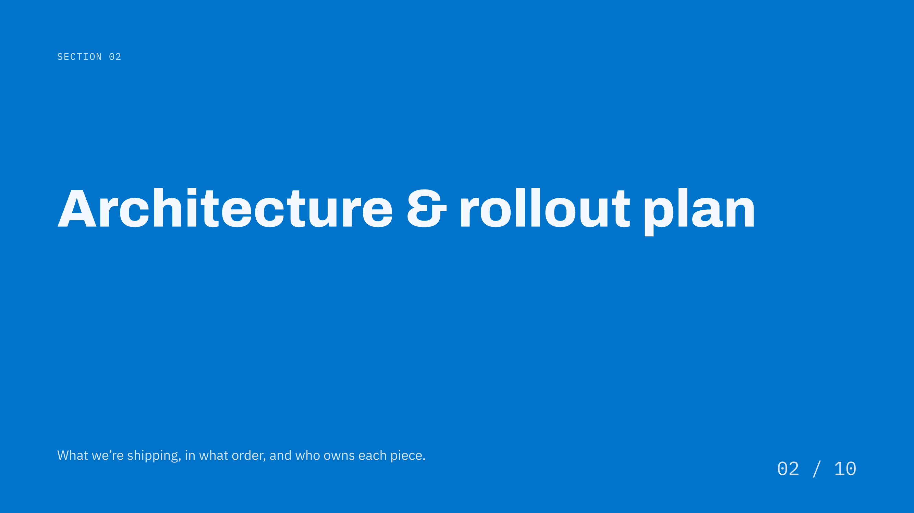
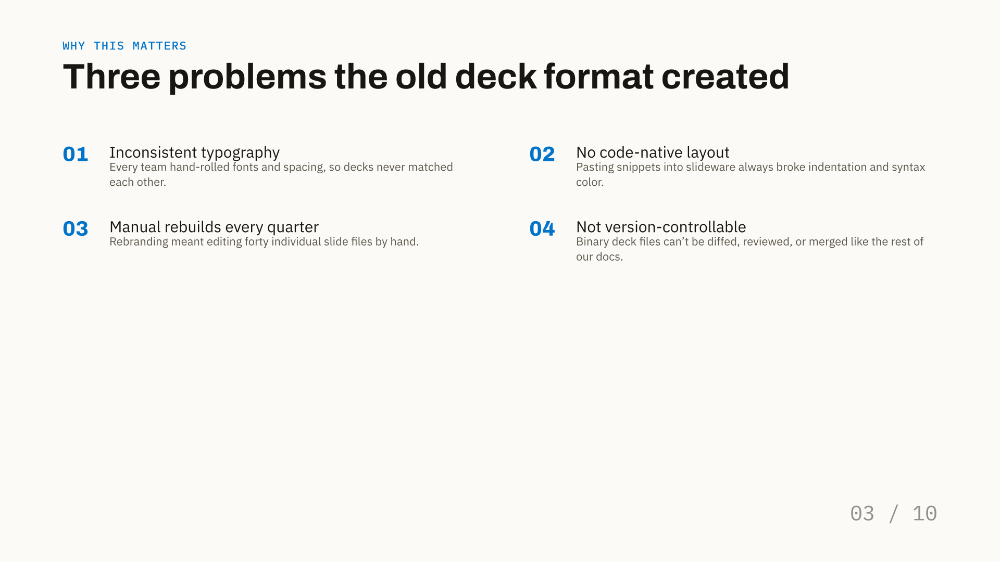
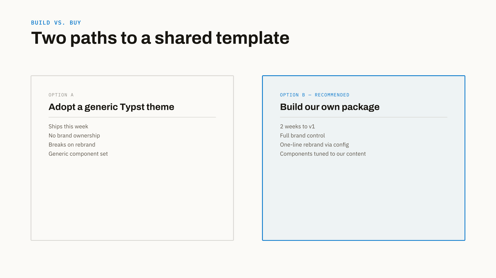
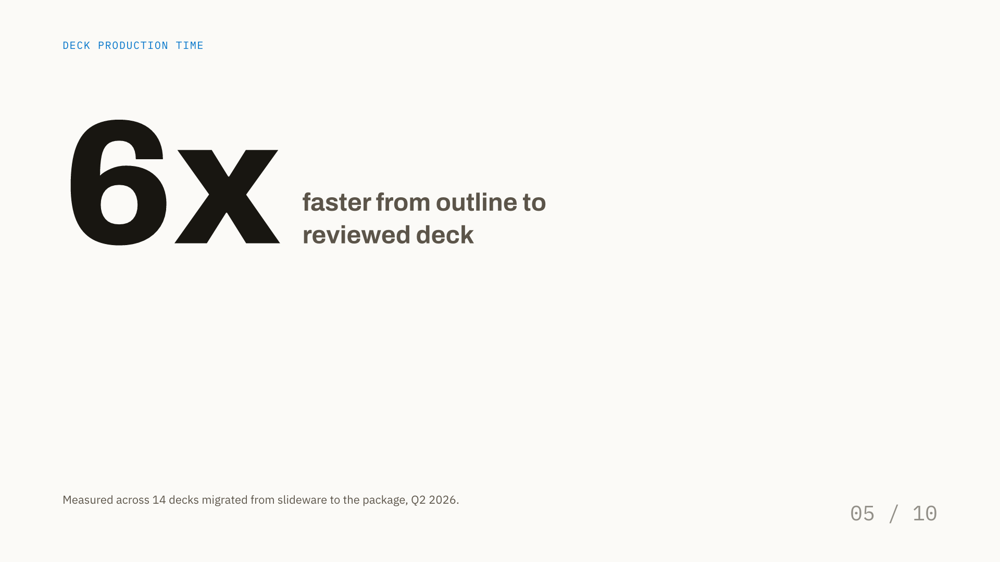
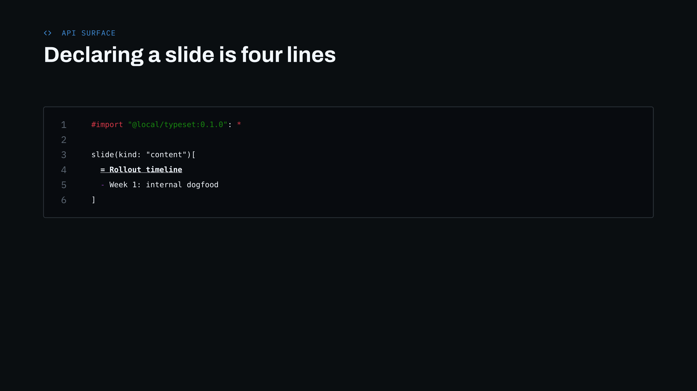

# SlateDeck

**SlateDeck** is a high-precision, opinionated presentation framework for [Typst](https://typst.app). Designed for developer talks, technical briefings, and executive updates, SlateDeck combines a strict typographic grid, automatic OKLCH color theming, and an integrated system architecture diagramming engine.

📖 **Documentation**: [https://ravisxcr.github.io/slate-deck/](https://ravisxcr.github.io/slate-deck/)

Every slide is declared with clean, structured parameters — no manual coordinate fiddling, no brittle CSS boxes, and complete one-line rebrands.

---

## Visual Gallery

Rendered natively with Typst using the SlateDeck public API:

| | |
|---|---|
|  |  |
| **`title`** — Cover slide with kicker, accent bar, and byline | **`section`** — Full-bleed accent divider between chapters |
|  |  |
| **`content`** — Structured body with numbered cards or grids | **`compare`** — 2-column comparison with recommended highlight |
|  |  |
| **`stat`** — Oversized hero metric with adjacent description | **`code`** — Line-numbered syntax-highlighted code block |
|  |  |
| **`diagram`** — Manual-placement architecture & ER diagram | **`closing`** — Matching accent-colored outro & contact slide |

---

## Quick Installation

Run the local installer from the repository root:

### Windows (PowerShell)
```powershell
./install.ps1
```

### macOS & Linux
```sh
chmod +x ./install.sh
./install.sh
```

The installer automatically installs the package and **registers the bundled fonts** (Archivo, IBM Plex Sans, IBM Plex Mono) into your user profile.

---

## Quickstart Example

Once installed, create your presentation file `my-deck.typ`:

```typst
#import "@local/slatedeck:0.1.0": *

// 1. Initialize the deck theme and metadata
#show: deck.with(
  title: "Modernizing Core Infrastructure",
  author: "Platform Engineering",
  accent: rgb("#4e61d8"), // Or hex string "#4e61d8"
)

// 2. Cover Slide
#slide(
  kind: "title",
  eyebrow: [Platform Architecture],
  eyebrow-icon: "terminal",
  title: [Slides That Read Like a Spec],
  subtitle: [A declarative Typst presentation framework for technical teams.],
  byline: ([Jordan Reyes], [Platform Eng], [Q3 2026]),
)

// 3. Content Slide with Numbered Cards
#slide(
  kicker: [Design Principles],
  title: [Three pillars of the new format],
  progress: [02 / 04],
)[
  #numbered-grid((
    ([Strict Layout Grid], [Eliminates manual alignment tweaks and broken offsets.]),
    ([Native Code Blocks], [Syntax highlighting and line numbers rendered natively.]),
    ([Instant Rebranding], [Derive the entire color scheme from a single hue value.]),
  ), columns: 3)
]
```

### Compile & Live Preview (Zero Extra Flags)

```sh
# Live watch mode:
typst watch my-deck.typ my-deck.pdf

# Single compile:
typst compile my-deck.typ my-deck.pdf
```

---

## Full Documentation

Explore the complete **Public Reference Manual** online at [**https://ravisxcr.github.io/slate-deck/**](https://ravisxcr.github.io/slate-deck/) or browse the guides in [**docs/**](docs/index.md):

- [**Getting Started**](docs/getting-started.md) — Installation, compilation, live watch mode, and best practices.
- [**Slide Kinds Reference**](docs/slides.md) — Comprehensive parameter tables and examples for all 11 built-in slide types.
- [**Components Reference**](docs/components.md) — Standalone cards, grids, metrics, pull-quotes, and schema tables.
- [**Diagrams Guide**](docs/diagram.md) — System architecture, cloud topologies, and database ER diagrams.
- [**Design Tokens & Theming**](docs/design-tokens.md) — Dynamic color palette derivation, type scale, and spacing.
- [**Icons & Fonts**](docs/icons-and-fonts.md) — 1,750+ Lucide icons, developer brand marks, and typography setup.

---

## License

MIT © Ravi
