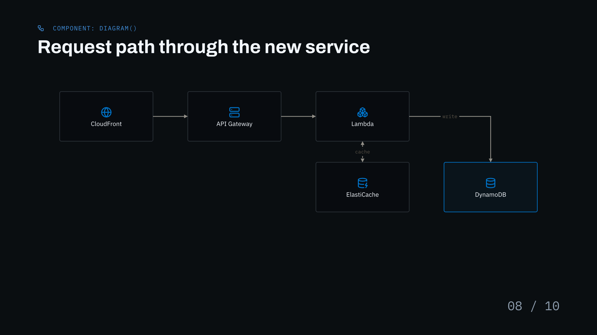
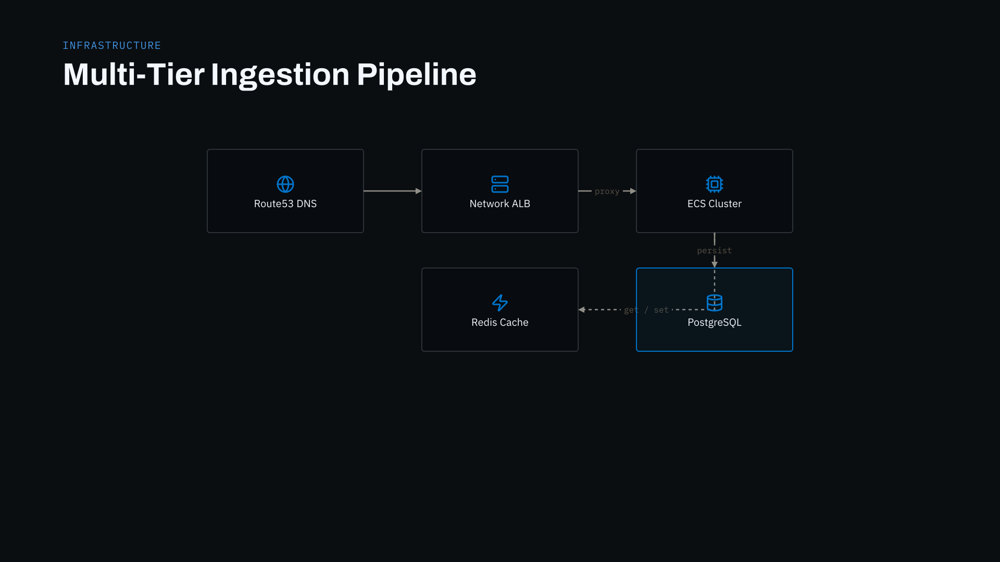
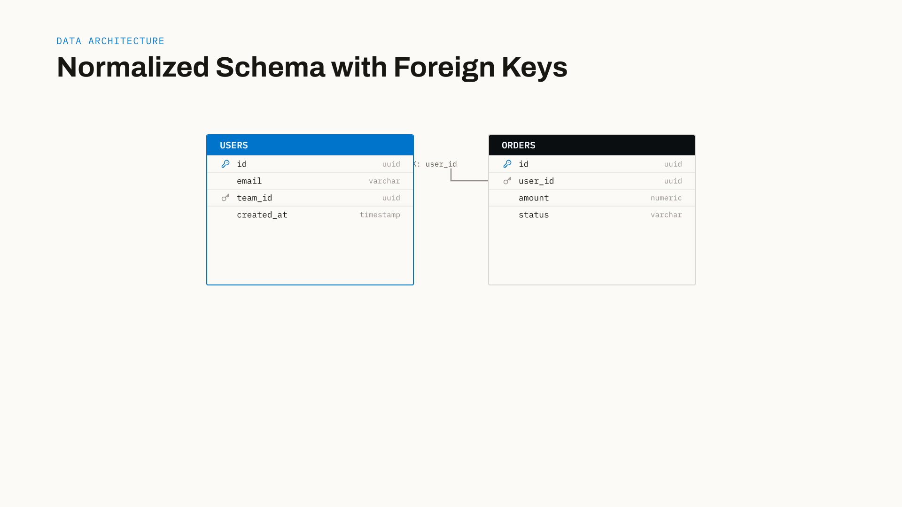

# Architecture & Flow Diagrams



SlateDeck includes a built-in, code-native **diagramming engine** (`diagram()`) for rendering cloud system architectures, database ER diagrams, and workflow flowcharts directly inside your slides.

Unlike external diagramming tools that generate static bitmaps, SlateDeck diagrams are authored in pure Typst: they inherit your presentation's color palette, crisp vector typography, and one-line rebrand system.

---

## 1. Quick Example

```typst
#slide(
  kind: "diagram",
  kicker: [Component: diagram()],
  kicker-icon: "workflow",
  title: [Request path through the new service],
  cols: 4,
  rows: 2,
  theme: "dark",
  nodes: (
    (id: "cdn",   pos: (col: 0, row: 0), icon: "globe",        label: [CloudFront]),
    (id: "api",   pos: (col: 1, row: 0), icon: "server",       label: [API Gateway]),
    (id: "fn",    pos: (col: 2, row: 0), icon: "boxes",        label: [Lambda]),
    (id: "cache", pos: (col: 2, row: 1), icon: "database-zap", label: [ElastiCache]),
    (id: "db",    pos: (col: 3, row: 1), icon: "database",     label: [DynamoDB], accent: true),
  ),
  edges: (
    (from: "cdn", to: "api"),
    (from: "api", to: "fn"),
    (from: "fn",  to: "cache", style: "dashed", arrow: "both", label: [cache]),
    (from: "fn",  to: "db",    label: [write]),
  ),
  progress: [08 / 10],
)
```

---

## 2. The Grid Mental Model

Diagrams in SlateDeck are arranged on an explicit **column-row grid** (0-indexed):

```
       col: 0          col: 1          col: 2
row: 0 [ (0, 0) ] ---- [ (1, 0) ] ---- [ (2, 0) ]
           |               |
row: 1 [ (0, 1) ] ---- [ (1, 1) ] ---- [ (2, 1) ]
```

- You define the grid size with `cols: N` and `rows: N`.
- You position every node using `pos: (col: X, row: Y)`.
- The engine automatically calculates canvas boundaries and routes connecting arrows between nodes.

---

## 3. Diagram Function Signature

```typst
#diagram(
  nodes,                                                // Positional: Array of node definitions
  edges: (),                                            // Array of connector definitions
  cols: 3,                                              // Total grid columns
  rows: 2,                                              // Total grid rows
  cell: (width: 150pt, height: 80pt),                   // Dimensions of a single grid cell
  gutter: (x: 56pt, y: 34pt),                           // Horizontal and vertical cell gaps
  table-style: (header-height: 22pt, row-height: 18pt), // Shared geometry for schema tables
  theme: "light",                                       // "light" | "dark"
)
```

---

## 4. Defining Nodes

SlateDeck supports two node kinds: **Box Nodes** (`kind: "box"`, default) and **Schema Table Nodes** (`kind: "table"`).

### 1. Box Nodes (`kind: "box"`)

Standard boxes for microservices, cloud resources, functions, or workflow steps.

```typst
(
  id: "auth-svc",
  pos: (col: 1, row: 0),
  label: [Auth Service],
  icon: "shield-check",
  icon-layout: "top",
  accent: true,
)
```

| Field | Type | Default | Required? | Description |
|---|---|---|---|---|
| `id` | `string` | — | **Yes** | Unique node identifier referenced by edge connectors. |
| `pos` | `dictionary` | — | **Yes** | Grid position: `(col: int, row: int)` (0-indexed). |
| `label` | `content` | — | **Yes** | Text label displayed inside the box. |
| `icon` | `string` | `none` | Optional | Name of a Lucide line icon or brand logo. |
| `icon-layout` | `string` | `"top"` | Optional | Icon placement: `"top"` (icon centered above label) or `"left"` (icon beside label). |
| `icon-brand` | `bool` | `false` | Optional | When `true`, loads the official full-color brand mark. |
| `icon-color` | `color` | `none` | Optional | Color override for the icon. |
| `accent` | `bool` | `false` | Optional | Highlights the node with an accent border and soft accent fill. |
| `span` | `dictionary` | `(colspan: 1, rowspan: 1)` | Optional | Multi-cell expansion: `(colspan: int, rowspan: int)`. |

### 2. Schema Table Nodes (`kind: "table"`)

Renders a complete database / ER schema table directly on the diagram canvas.

```typst
(
  id: "users-table",
  kind: "table",
  pos: (col: 0, row: 0),
  name: "users",
  accent: true,
  columns: (
    (name: "id",         type: "uuid",      key: "pk"),
    (name: "email",      type: "varchar"),
    (name: "created_at", type: "timestamp"),
  ),
)
```

| Field | Type | Default | Required? | Description |
|---|---|---|---|---|
| `id` | `string` | — | **Yes** | Node identifier referenced by edges. |
| `kind` | `string` | `"box"` | **Yes** | Set to `"table"` for schema tables. |
| `pos` | `dictionary` | — | **Yes** | Grid position `(col: int, row: int)`. |
| `name` | `string` | — | **Yes** | Table name shown in the table header. |
| `columns` | `array` | — | **Yes** | Array of column dictionaries: `((name:, type:, key:), ...)`. |
| `accent` | `bool` | `false` | Optional | Highlights the table header in accent color. |

---

## 5. Defining Edges & Connectors

Edges connect nodes with straight lines or right-angle elbow connectors.

```typst
(
  from: "auth-svc",
  to: "database",
  arrow: "end",
  style: "solid",
  label: [verify],
)
```

| Field | Type | Default | Description |
|---|---|---|---|
| `from` | `string` or `dict` | *Required* | Source node ID string, or `(id: "table_id", row: int)` for row anchors. |
| `to` | `string` or `dict` | *Required* | Target node ID string, or `(id: "table_id", row: int)` for row anchors. |
| `arrow` | `string` | `"end"` | Arrowheads: `"end"` (pointing forward), `"both"`, or `"none"`. |
| `style` | `string` | `"solid"` | Connector style: `"solid"` or `"dashed"`. |
| `color` | `color` | `none` | Custom stroke color (defaults to `theme.ink-faint`). |
| `bend` | `string` | `"auto"` | Elbow mode: `"auto"`, `"h-then-v"`, or `"v-then-h"`. |
| `label` | `content` | `none` | Text pill label placed at the connector's midpoint. |
| `label-offset` | `dict` | `(dx: 0pt, dy: 0pt)` | Fine-tuning offset for the label position. |

### Row-Level Table Anchors

For Entity-Relationship (ER) diagrams, you can anchor connectors directly to specific database table rows (columns) instead of the whole box:

```typst
edges: (
  // Connects row 1 ("user_id") of orders to row 0 ("id") of users:
  (from: (id: "orders", row: 1), to: (id: "users", row: 0), label: [FK]),
)
```

---

## 6. Real-World Examples

### Example A: Cloud Architecture (Dark Theme)



```typst
#slide(
  kind: "diagram",
  kicker: [Infrastructure],
  title: [Multi-Tier Ingestion Pipeline],
  cols: 3,
  rows: 2,
  theme: "dark",
  nodes: (
    (id: "dns",    pos: (col: 0, row: 0), icon: "globe",        label: [Route53 DNS]),
    (id: "lb",     pos: (col: 1, row: 0), icon: "server",       label: [Network ALB]),
    (id: "app",    pos: (col: 2, row: 0), icon: "cpu",          label: [ECS Cluster]),
    (id: "cache",  pos: (col: 1, row: 1), icon: "zap",          label: [Redis Cache]),
    (id: "db",     pos: (col: 2, row: 1), icon: "database",     label: [PostgreSQL], accent: true),
  ),
  edges: (
    (from: "dns",   to: "lb"),
    (from: "lb",    to: "app",   label: [proxy]),
    (from: "app",   to: "cache", label: [get / set], style: "dashed", bend: "v-then-h"),
    (from: "app",   to: "db",    label: [persist]),
  ),
)
```

### Example B: Database ER Schema (Light Theme)



```typst
#slide(
  kind: "diagram",
  kicker: [Data Architecture],
  title: [Normalized Schema with Foreign Keys],
  cols: 2,
  rows: 1,
  theme: "light",
  cell: (width: 220pt, height: 160pt),
  gutter: (x: 80pt, y: 34pt),
  nodes: (
    (
      id: "users",
      kind: "table",
      pos: (col: 0, row: 0),
      name: "users",
      columns: (
        (name: "id",         type: "uuid",      key: "pk"),
        (name: "email",      type: "varchar"),
        (name: "team_id",    type: "uuid",      key: "fk"),
        (name: "created_at", type: "timestamp"),
      ),
      accent: true,
    ),
    (
      id: "orders",
      kind: "table",
      pos: (col: 1, row: 0),
      name: "orders",
      columns: (
        (name: "id",         type: "uuid",      key: "pk"),
        (name: "user_id",    type: "uuid",      key: "fk"),
        (name: "amount",     type: "numeric"),
        (name: "status",     type: "varchar"),
      ),
    ),
  ),
  edges: (
    (from: (id: "orders", row: 1), to: (id: "users", row: 0), label: [FK: user_id]),
  ),
)
```

---

## 7. Troubleshooting & Layout Tips

!!! tip "Routing Lanes"
    If an elbow connector crosses through an intermediate node on a crowded diagram, add an empty column or row between them to serve as a clear routing lane.

!!! note "Using `diagram()` in `content` Slides"
    You can also call `diagram()` directly inside any `#slide(kind: "content")[ ... ]` body if you want to place custom descriptive copy or a legend alongside the diagram.
