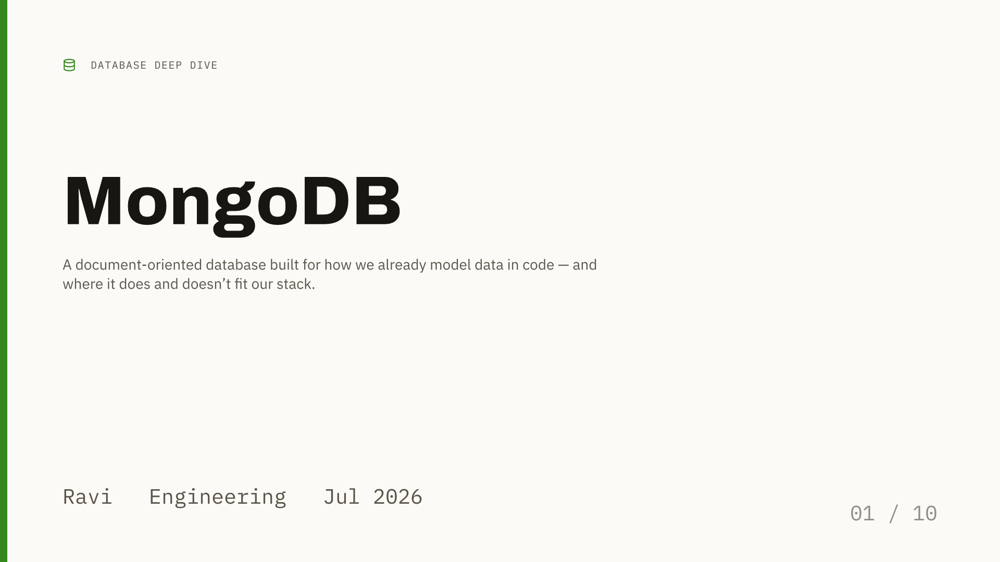
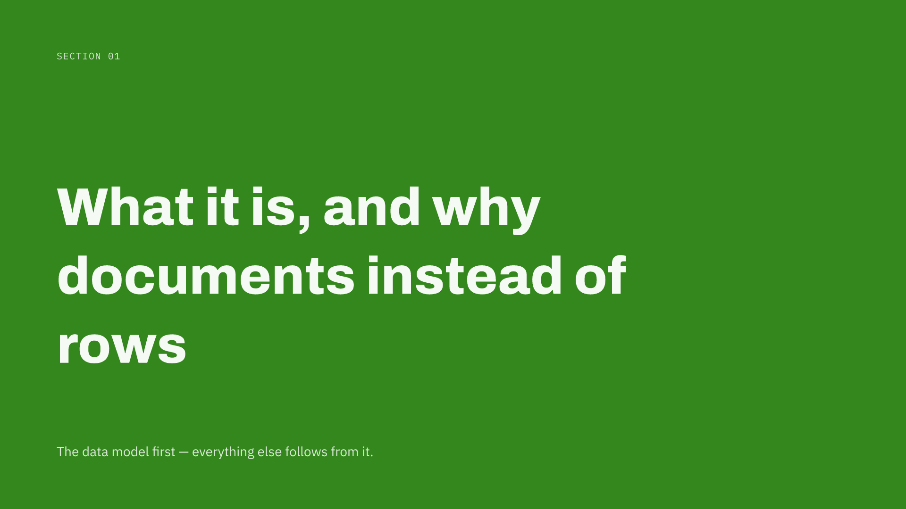
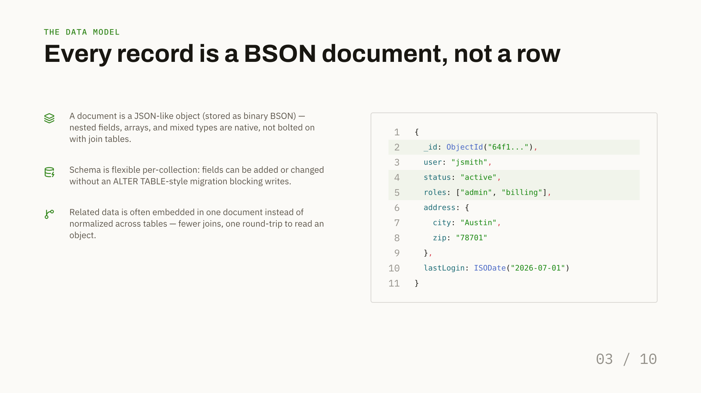
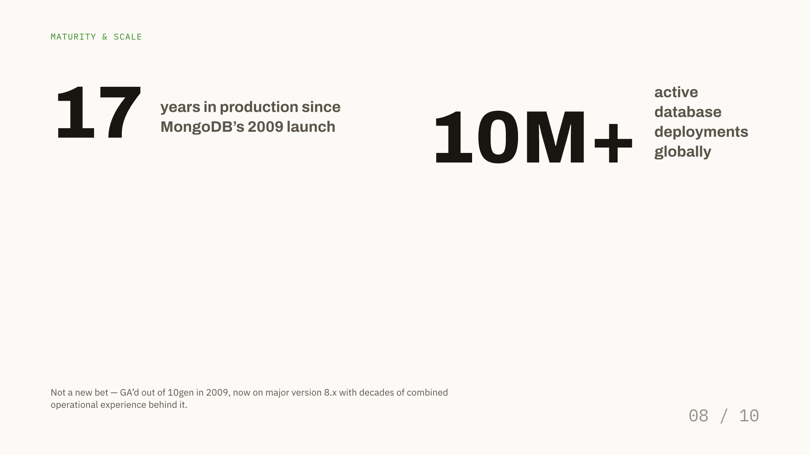
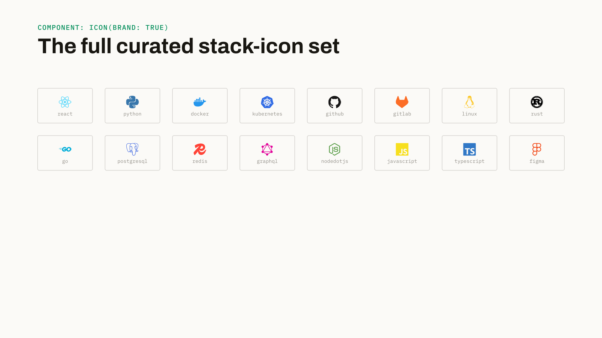
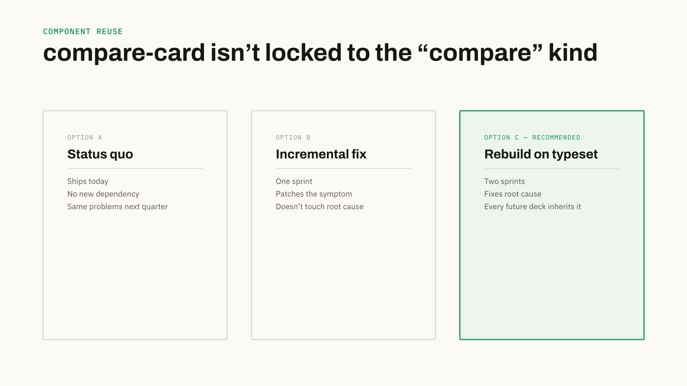
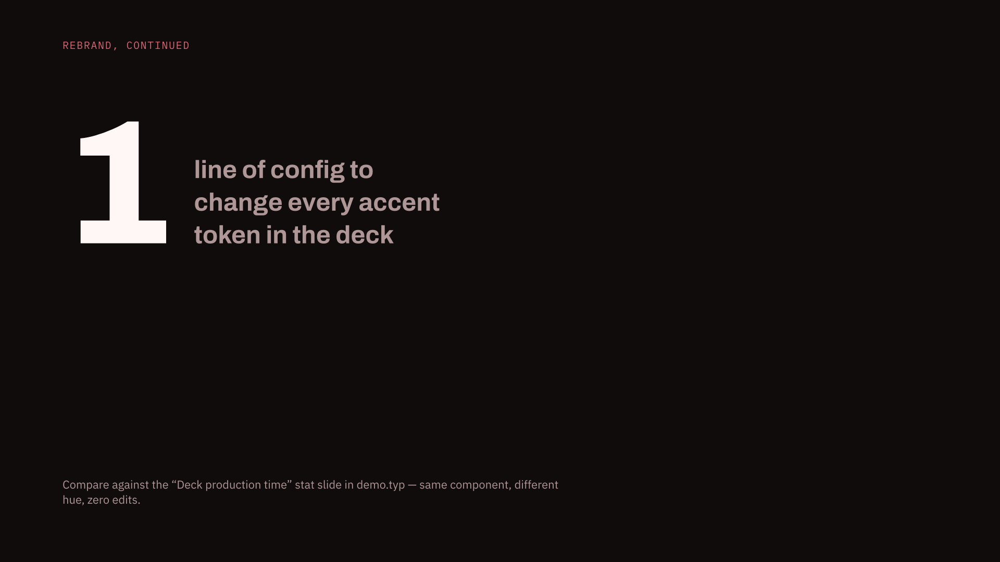
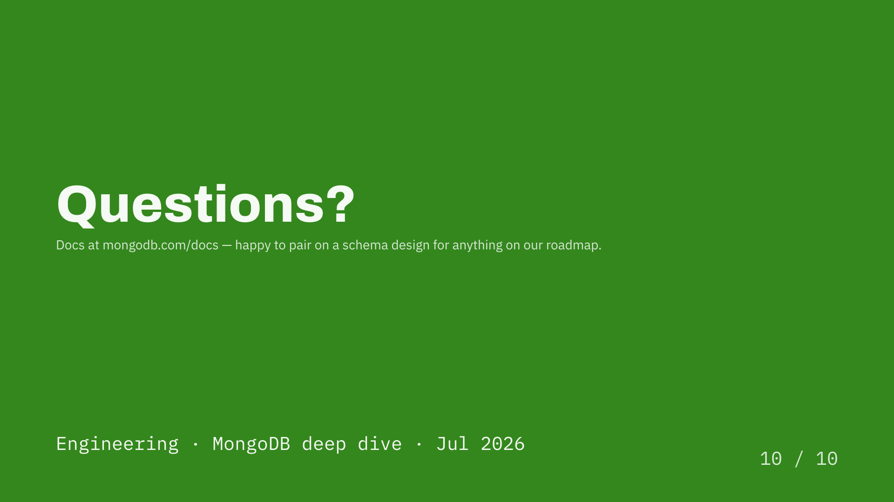

# SlateDeck Documentation

**SlateDeck** is a high-precision, opinionated presentation framework for [Typst](https://typst.app). It is engineered for developer talks, technical briefings, and executive updates where crisp typography, code clarity, and architectural precision matter.

With SlateDeck, you declare slides with clean, structured parameters instead of hand-tuning CSS or fighting fragile layout boxes. A complete rebrand requires changing only a single theme parameter.

---

## Key Features

- **Structured Slide Types**: 11 purpose-built slide kinds (`title`, `section`, `content`, `compare`, `stat`, `code`, `diagram`, `quote`, `team`, `image`, `closing`) designed for rapid authoring.
- **Standalone Component Library**: Modular UI primitives including cards, multi-column grids, pull quotes, database ER tables, and stat counters.
- **Built-in Architecture Diagramming**: Manual-placement node-and-edge diagram canvas with automatic elbow routing, row-level schema anchors, and zero external dependencies.
- **Instant One-Line Theming**: Full-spectrum OKLCH color generation derived dynamically from a single hue value (`accent-hue`).
- **1,750+ Bundled Icons**: Full [Lucide](https://lucide.dev) line icon set plus popular developer brand marks from [Simple Icons](https://simpleicons.org), with automatic sizing and baseline alignment.
- **Precision Typography**: Bundled static weights of Archivo (Display), IBM Plex Sans (Body), and IBM Plex Mono (Code & Kickers) for reproducible offline rendering.

---

## Documentation Guide

| Guide | Description |
|---|---|
| [**Getting Started**](getting-started.md) | Package installation, compilation commands, watch mode, and building your first deck in under 2 minutes. |
| [**Slide Kinds Reference**](slides.md) | Comprehensive parameter reference, layout previews, and code examples for all 11 built-in slide kinds. |
| [**Components Reference**](components.md) | Standalone UI components (`numbered-grid`, `cols`, `compare-card`, `code-block`, `er-table`, etc.) for custom layouts. |
| [**Diagrams & Architecture**](diagram.md) | Complete guide to creating system architectures, database schemas, and flowcharts with `diagram()`. |
| [**Design Tokens & Theming**](design-tokens.md) | Color palette tokens, dynamic rebrand configuration, type scales, and spacing standards. |
| [**Icons & Fonts**](icons-and-fonts.md) | Browsing the 1,750+ icon library, inline icon alignment, brand marks, and bundled typography. |

---

## Visual Showcase

Every slide below is rendered natively by Typst using the SlateDeck public API:

| | |
|---|---|
|  |  |
| **`title`** — Cover slide with kicker, accent bar, and byline | **`section`** — Full-bleed accent divider between deck chapters |
|  |  |
| **`content`** — Freeform body with multi-column grids and code blocks | **`compare`** — 2-column feature comparison with recommended highlight |
|  |  |
| **`code`** — Line-numbered syntax-highlighted code block with focus tints | **`stat`** — Dark navy backdrop with oversized hero metric |
|  |  |
| **`icon(brand: true)`** — Full-color developer and cloud logos | **Component Reuse** — Modular cards composed into custom 3-column grids |
|  |  |
| **One-Line Rebrand** — Instant palette shift via `accent-hue` | **`closing`** — Matching accent-colored outro and contact slide |

---

## Quick Example

```typst
#import "@local/slatedeck:0.1.0": *

// 1. Initialize the deck theme and metadata
#show: deck.with(
  title: "Cloud Migration Strategy",
  author: "Infrastructure Team",
  accent-hue: 215deg, // Royal Blue
)

// 2. Cover Slide
#slide(
  kind: "title",
  eyebrow: [Engineering Roadmap],
  eyebrow-icon: "cloud",
  title: [Modernizing our Core Platform],
  subtitle: [A phased transition to event-driven serverless architecture.],
  byline: ([Dev Team], [Platform Eng], [Q3 2026]),
)

// 3. Section Divider
#slide(
  kind: "section",
  label: [Phase 01],
  title: [Current Architecture & Bottlenecks],
  progress: [01 / 04],
)

// 4. Content Slide with Numbered Grid
#slide(
  kicker: [Key Challenges],
  title: [Three limitations of the legacy stack],
  progress: [02 / 04],
)[
  #numbered-grid((
    ([Monolithic Database], [Single point of failure during peak traffic spikes.]),
    ([Coupled Deployments], [Coordinating releases requires cross-team synchronization.]),
    ([High Latency], [Regional users experience 300ms+ roundtrip overhead.]),
  ), columns: 3)
]
```

---

## The SlateDeck Philosophy

1. **Declarative Over Imperative**: Declare *what* content belongs on a slide, not *where* to place every pixel.
2. **Predictable Geometry**: Authored for standard 16:9 widescreen displays (960pt × 540pt), ensuring your slides look identical whether projected in an auditorium or viewed on a laptop.
3. **Harmonious Color Theory**: By deriving all UI fills, borders, text contrasts, and highlight tones from OKLCH math, your presentations always maintain professional contrast ratios across light and dark slides.
