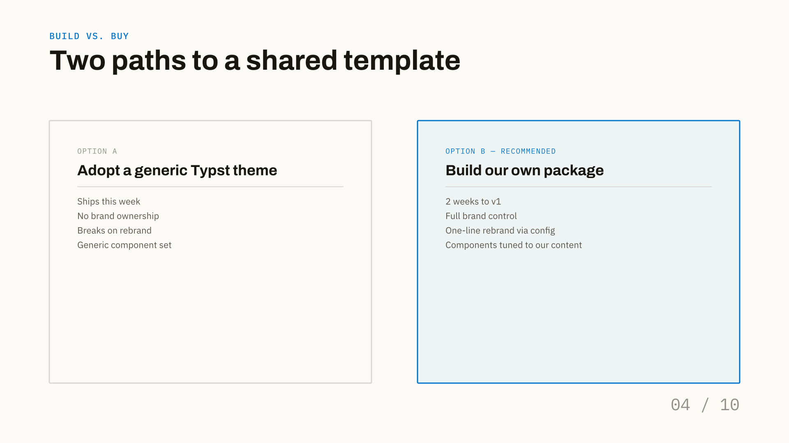
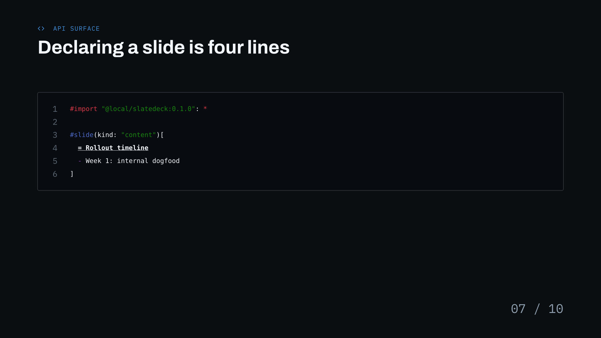

# Slide Kinds Reference

SlateDeck provides **11 built-in slide layouts** covering title slides, section dividers, structured content, code demonstrations, comparisons, metrics, quotes, team rosters, and architecture diagrams.

Every slide is authored using the unified `#slide(...)` function:

```typst
#slide(
  kind: "content", // Slide layout type (defaults to "content")
  kicker: [Topic],
  title: [Slide Title],
  progress: [02 / 10], // Optional slide progress marker
)[
  // Body content (for "content" slides)
]
```

!!! note "Progress Indicator"
    Slide progress can be enabled globally via `#show: deck.with(progress: true)` to automatically compute and render monospace counters in the bottom-right corner (e.g. `03 / 12`).
    
    You can also control progress per slide using the `progress:` parameter:
    - `progress: false` — explicitly hides the progress counter on that slide (useful for section dividers or intro slides).
    - `progress: true` — forces automatic progress rendering on that slide.
    - `progress: [03 / 12]` — supplies a custom progress marker.

---

## 1. `title` — Cover Slide


The primary presentation cover slide. Features a vertical accent bar on the left edge, an optional eyebrow label with icon, large display title, subtitle, and an evenly spaced byline row.

### Parameters

| Parameter | Type | Default | Required? | Description |
|---|---|---|---|---|
| `title` | `content` | `none` | **Yes** | Main presentation title (rendered in large Archivo Display bold). |
| `eyebrow` | `content` | `none` | Optional | Small uppercase mono label displayed above the title. |
| `eyebrow-icon` | `string` | `none` | Optional | Name of a Lucide icon displayed adjacent to the eyebrow. |
| `subtitle` | `content` | `none` | Optional | Descriptive subtitle copy in muted text color. |
| `byline` | `array` | `()` | Optional | Array of metadata items displayed along the bottom, e.g. `([Author], [Team], [Date])`. |

### Exact Code for Above Slide

```typst
#slide(
  kind: "title",
  eyebrow: [SlateDeck — Presentation Framework],
  eyebrow-icon: "terminal",
  title: [Slides that read like a spec.],
  subtitle: [A Typst template system for corporate updates and developer talks — built on a strict grid, one accent color, and typography that holds up at the back of the room.],
  byline: ([Jordan Reyes], [Platform Engineering], [Jul 2026]),
)
```

---

## 2. `section` — Chapter Divider


A full-bleed slide filled with your deck's `accent` color. Used to introduce major agenda transitions and sections.

### Parameters

| Parameter | Type | Default | Required? | Description |
|---|---|---|---|---|
| `title` | `content` | `none` | **Yes** | Chapter or section headline (rendered in high-contrast on-accent text). |
| `label` | `content` | `none` | Optional | Upper-left kicker label, e.g. `[Section 02]`. |
| `blurb` | `content` | `none` | Optional | Short paragraph describing the section's objectives. |
| `progress` | `content` | `none` | Optional | Monospace slide marker, e.g. `[02 / 10]`. |

### Exact Code for Above Slide

```typst
#slide(
  kind: "section",
  label: [Section 02],
  title: [Architecture & rollout plan],
  blurb: [What we're shipping, in what order, and who owns each piece.],
  progress: [02 / 10],
)
```

---

## 3. `content` — General Purpose (Default)


The primary workhorse slide layout. Provides a standardized kicker and headline header, leaving the remaining canvas available for any combination of components, grids, bullet lists, or raw Typst markup.

### Parameters

| Parameter | Type | Default | Required? | Description |
|---|---|---|---|---|
| `body` | `content` | `[]` | **Yes** | Positional content block passed inside `[ ... ]`. |
| `kicker` | `content` | `none` | Optional | Uppercase mono label above the headline in accent color. |
| `title` | `content` | `none` | Optional | Primary slide headline (Archivo 34pt bold). |
| `progress` | `content` | `none` | Optional | Bottom-right progress marker. |

### Exact Code for Above Slide

```typst
#slide(kicker: [Why this matters], title: [Three problems the old deck format created], progress: [03 / 10])[
  #numbered-grid((
    ([Inconsistent typography], [Every team hand-rolled fonts and spacing, so decks never matched each other.]),
    ([No code-native layout], [Pasting snippets into slideware always broke indentation and syntax color.]),
    ([Manual rebuilds every quarter], [Rebranding meant editing forty individual slide files by hand.]),
    ([Not version-controllable], [Binary deck files can't be diffed, reviewed, or merged like the rest of our docs.]),
  ))
]
```

---

## 4. `compare` — Feature & Option Comparison



A structured two-column comparison layout. Each column is rendered as a clean bordered card. Setting `recommended: true` on either card applies an accent border and soft accent fill to emphasize the preferred option.

### Parameters

| Parameter | Type | Default | Required? | Description |
|---|---|---|---|---|
| `left` | `dictionary` | `none` | **Yes** | Left card definition: `(label:, title:, items:, recommended:)`. |
| `right` | `dictionary` | `none` | **Yes** | Right card definition: `(label:, title:, items:, recommended:)`. |
| `kicker` | `content` | `none` | Optional | Uppercase mono kicker label. |
| `title` | `content` | `none` | Optional | Slide headline. |
| `progress` | `content` | `none` | Optional | Bottom-right progress marker. |

### Card Dictionary Fields
- `label`: Small uppercase card header (e.g. `[Option A]`).
- `title`: Main card title (e.g. `[Adopt a generic Typst theme]`).
- `items`: Array of content items rendered as bulletless feature lines.
- `recommended`: Boolean (`true` / `false`). Toggles accent highlight styling.

### Exact Code for Above Slide

```typst
#slide(
  kind: "compare",
  kicker: [Build vs. buy],
  title: [Two paths to a shared template],
  left: (
    label: [Option A],
    title: [Adopt a generic Typst theme],
    items: ([Ships this week], [No brand ownership], [Breaks on rebrand], [Generic component set]),
  ),
  right: (
    label: [Option B — recommended],
    title: [Build our own package],
    items: ([2 weeks to v1], [Full brand control], [One-line rebrand via config], [Components tuned to our content]),
    recommended: true,
  ),
  progress: [04 / 10],
)
```

---

## 5. `stat` — Key Metric Hero & Multi-Stat Grid


A high-impact metric slide featuring either a single oversized hero number (170pt display font) or a multi-stat grid (2, 3, 4, or more stats) arranged across customizable columns and flow directions.

### Parameters

| Parameter | Type | Default | Required? | Description |
|---|---|---|---|---|
| `value` | `content` | `none` | Optional* | Large metric value for single-stat mode (e.g. `[6x]`, `[99.9%]`). |
| `caption` | `content` | `none` | Optional* | Bold description rendered adjacent to the number. |
| `stats` | `array` | `()` | Optional* | Array of stat pairs `(([val], [cap]), ...)` or dictionaries `((value: [..], caption: [..]), ...)`. |
| `columns` | `int` or `auto` | `auto` | Optional | Number of columns in multi-stat mode (default `auto` adapts to stat count). |
| `direction` | `string` | `"row"` | Optional | Flow order: `"row"` (left-to-right across rows) or `"column"` (top-to-bottom per column). |
| `size` | `string` or `length` | `auto` | Optional | Metric size preset: `"hero"` (170pt), `"lg"` (88pt), `"md"` (64pt), `"sm"` (46pt), or custom length. |
| `kicker` | `content` | `none` | Optional | Top mono label. |
| `kicker-icon` | `string` | `none` | Optional | Lucide icon name for kicker. |
| `theme` | `string` | `"light"` | Optional | Color scheme: `"light"` (paper), `"dark"` (navy), or `"accent"`. |
| `fill` | `color` | `none` | Optional | Custom background fill color override. |
| `note` | `content` | `none` | Optional | Footnote or source citation anchored at the bottom-left. |
| `progress` | `bool` or `content` | `none` | Optional | Progress marker override (`true`, `false`, or custom content). |

*\* Either provide `value` + `caption` for a single hero stat, or pass an array of items to `stats`.*

### Single-Stat Example

```typst
#slide(
  kind: "stat",
  kicker: [Deck production time],
  value: [6x],
  caption: [faster from outline to reviewed deck],
  note: [Measured across 14 decks migrated from slideware to the package, Q2 2026.],
  progress: [05 / 10],
)
```

### Multi-Stat Grid Example

```typst
#slide(
  kind: "stat",
  kicker: [Platform Performance],
  kicker-icon: "activity",
  stats: (
    ([17], [years in production since launch]),
    ([99.99%], [uptime across managed clusters]),
    ([10M+], [active database deployments]),
    ([200+], [countries with daily active users]),
  ),
  columns: 2,
  direction: "column", // Fills left column first, then right column
  note: [Global telemetry metrics measured across Q2 2026 production clusters.],
)
```

---

## 6. `image` — Full-Bleed Media & Screenshot


A full-bleed slide layout for high-resolution graphics, product UI screenshots, or architectural diagrams. Includes a navy caption bar pinned to the bottom-left corner.

### Parameters

| Parameter | Type | Default | Required? | Description |
|---|---|---|---|---|
| `image` | `content` | `none` | **Yes** | Any Typst image or box content (e.g. `image("photo.jpg", fit: "cover")` or placeholder). |
| `caption-title` | `content` | `none` | Optional | Bold title within the bottom-left overlay bar. |
| `caption-body` | `content` | `none` | Optional | Secondary explanatory text within the overlay bar. |
| `progress` | `content` | `none` | Optional | Bottom-right progress marker. |

### Exact Code for Above Slide

```typst
#slide(
  kind: "image",
  image: rect(width: 100%, height: 100%, fill: luma(230))[
    #align(center + horizon)[
      #text(font: "IBM Plex Mono", size: 13pt, fill: luma(100))[\[ product screenshot — drop full-bleed image here \]]
    ]
  ],
  caption-title: [Dashboard v2],
  caption-body: [Redesigned monitoring view, shipping with this release],
  progress: [06 / 10],
)
```

---

## 7. `code` — Syntax-Highlighted Code Showcase



A dedicated slide for presenting syntax-highlighted source code with line numbers, custom language tagging, and accent line highlights.

### Parameters

| Parameter | Type | Default | Required? | Description |
|---|---|---|---|---|
| `code` | `string` or `raw` | `none` | **Yes** | Source code text or raw block ` ```lang ... ``` `. |
| `title` | `content` | `none` | Optional | Slide headline. |
| `kicker` | `content` | `none` | Optional | Top mono label. |
| `kicker-icon` | `string` | `none` | Optional | Lucide icon name for kicker (e.g. `"terminal"`, `"code"`). |
| `lang` | `string` | `none` | Optional | Language identifier for syntax highlighting (e.g. `"js"`, `"rust"`, `"python"`, `"typ"`). |
| `theme` | `string` | `"light"` | Optional | Code block color scheme: `"light"` (paper backdrop) or `"dark"` (navy backdrop). |
| `highlight` | `array` | `()` | Optional | Array of line numbers or inclusive ranges to highlight, e.g. `(3, (5, 7))`. |
| `progress` | `content` | `none` | Optional | Bottom-right progress marker. |

### Exact Code for Above Slide

```typst
#slide(
  kind: "code",
  kicker: [API surface],
  kicker-icon: "code",
  title: [Declaring a slide is four lines],
  lang: "typ",
  code: "#import \"@local/slatedeck:0.1.0\": *\n\n#slide(kind: \"content\")[\n  = Rollout timeline\n  - Week 1: internal dogfood\n]",
  progress: [07 / 10],
)
```

---

## 8. `diagram` — System Architecture Canvas


A full-canvas architectural diagram slide. Renders box nodes, database tables, and connecting arrows on an explicit column-row grid with automatic elbow connector routing.

For complete details on grid math, node properties, and connector routing, see the [**Diagrams Guide**](diagram.md).

### Parameters

| Parameter | Type | Default | Required? | Description |
|---|---|---|---|---|
| `nodes` | `array` | `()` | **Yes** | Array of node definition dictionaries. |
| `edges` | `array` | `()` | Optional | Array of edge connector dictionaries. |
| `title` | `content` | `none` | Optional | Slide headline. |
| `kicker` | `content` | `none` | Optional | Top mono label. |
| `kicker-icon` | `string` | `none` | Optional | Icon name for the kicker. |
| `cols` | `int` | `3` | Optional | Number of horizontal grid columns. |
| `rows` | `int` | `2` | Optional | Number of vertical grid rows. |
| `theme` | `string` | `"dark"` | Optional | Diagram color scheme: `"dark"` or `"light"`. |
| `cell` | `dictionary` | `(width: 150pt, height: 80pt)` | Optional | Dimensions of each grid cell. |
| `gutter` | `dictionary` | `(x: 56pt, y: 34pt)` | Optional | Horizontal and vertical gaps between cells. |
| `progress` | `content` | `none` | Optional | Bottom-right progress marker. |

### Exact Code for Above Slide

```typst
#slide(
  kind: "diagram",
  kicker: [Component: diagram()],
  kicker-icon: "workflow",
  title: [Request path through the new service],
  cols: 4,
  rows: 2,
  theme: "dark",
  nodes: (
    (id: "cdn",   pos: (col: 0, row: 0), icon: "globe",        label: [CloudFront]),
    (id: "api",   pos: (col: 1, row: 0), icon: "server",       label: [API Gateway]),
    (id: "fn",    pos: (col: 2, row: 0), icon: "boxes",        label: [Lambda]),
    (id: "cache", pos: (col: 2, row: 1), icon: "database-zap", label: [ElastiCache]),
    (id: "db",    pos: (col: 3, row: 1), icon: "database",     label: [DynamoDB], accent: true),
  ),
  edges: (
    (from: "cdn", to: "api"),
    (from: "api", to: "fn"),
    (from: "fn",  to: "cache", style: "dashed", arrow: "both", label: [cache]),
    (from: "fn",  to: "db",    label: [write]),
  ),
  progress: [08 / 10],
)
```

---

## 9. `quote` — Pull-Quote & Testimonial


A centered pull-quote layout featuring an accent bar, large display quote text (32pt), and an author avatar badge with role attribution.

### Parameters

| Parameter | Type | Default | Required? | Description |
|---|---|---|---|---|
| `quote` | `content` | `none` | **Yes** | Main quote text block. |
| `name` | `content` | `none` | **Yes** | Attribution name. |
| `role` | `content` | `none` | Optional | Attribution title, company, or team role. |
| `progress` | `content` | `none` | Optional | Bottom-right progress marker. |

### Exact Code for Above Slide

```typst
#slide(
  kind: "quote",
  quote: [Switching to the shared template meant every team's deck finally looked like it came from the same company.],
  name: [Priya Nathan],
  role: [VP, Developer Platform],
  progress: [09 / 10],
)
```

---

## 10. `team` — Multi-Column Roster


An N-column grid of team member cards, each featuring a photo placeholder block, prominent name, and role title.

### Parameters

| Parameter | Type | Default | Required? | Description |
|---|---|---|---|---|
| `members` | `array` | `()` | **Yes** | Array of member dictionaries: `((name: [...], role: [...]), ...)`. |
| `kicker` | `content` | `none` | Optional | Top mono kicker label. |
| `title` | `content` | `none` | Optional | Slide headline. |
| `columns` | `int` | `4` | Optional | Number of horizontal team card columns (default `4`). |
| `progress` | `content` | `none` | Optional | Bottom-right progress marker. |

### Exact Code for Above Slide

```typst
#slide(
  kind: "team",
  kicker: [Who's building it],
  title: [The core package team],
  columns: 4,
  members: (
    (name: [Jordan Reyes], role: [Platform Eng]),
    (name: [Priya Nathan], role: [Dev Platform VP]),
    (name: [Marcus Ito],   role: [Typography]),
    (name: [Ana Cole],     role: [Design Systems]),
  ),
  progress: [10 / 10],
)
```

---

## 11. `closing` — Outro & Contact


A matching outro slide on full accent background. Perfect for thank-you messages, repository links, contact info, and concluding Q&A.

### Parameters

| Parameter | Type | Default | Required? | Description |
|---|---|---|---|---|
| `title` | `content` | `none` | **Yes** | Large concluding display headline. |
| `subtitle` | `content` | `none` | Optional | Supporting farewell or discussion prompt. |
| `footer` | `content` | `none` | Optional | Monospace link / contact footer anchored in the bottom-left. |

### Exact Code for Above Slide

```typst
#slide(
  kind: "closing",
  title: [Thank you.],
  subtitle: [Package docs, install instructions, and source live at the link below.],
  footer: [github.com/ravisxcr/slate-deck · \#design-systems],
)
```
