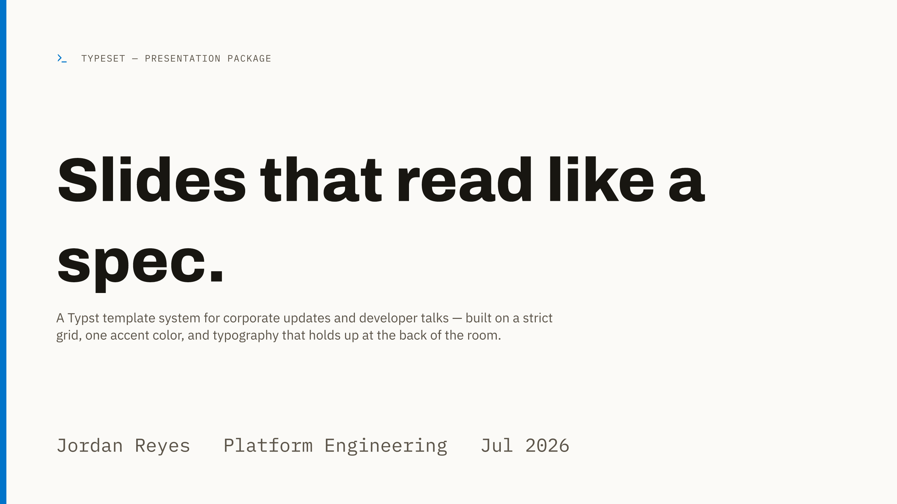
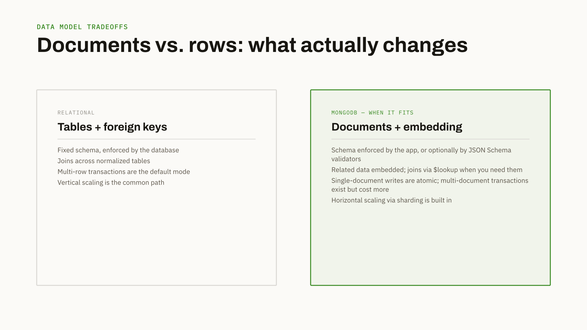
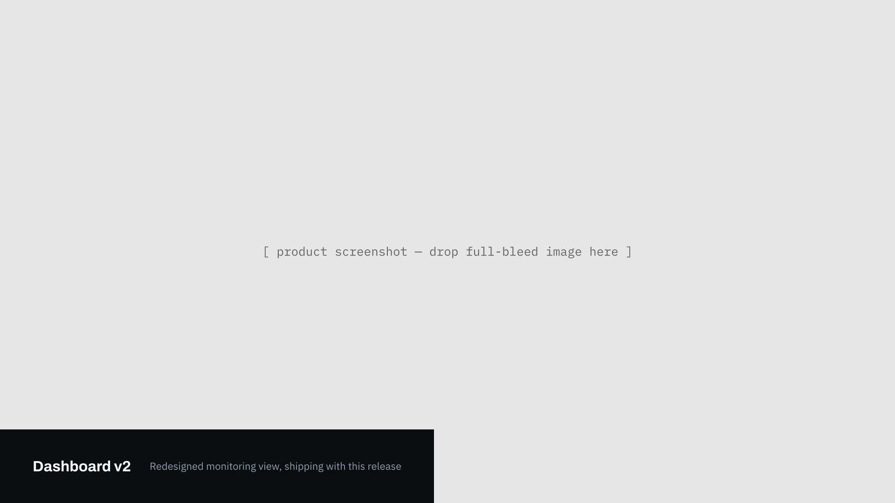
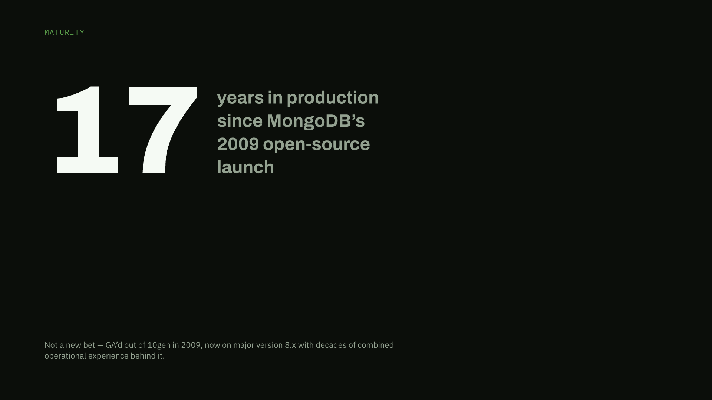
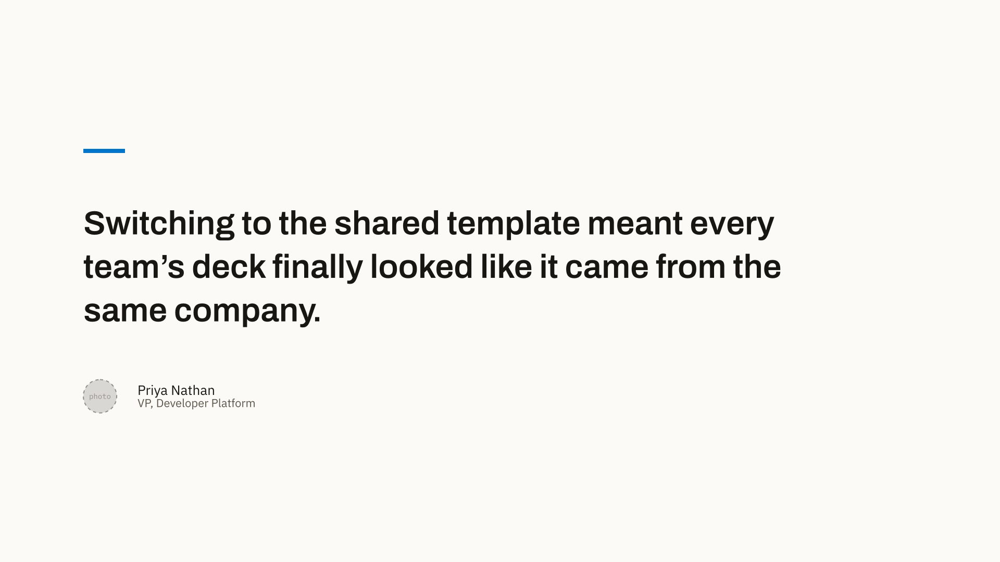
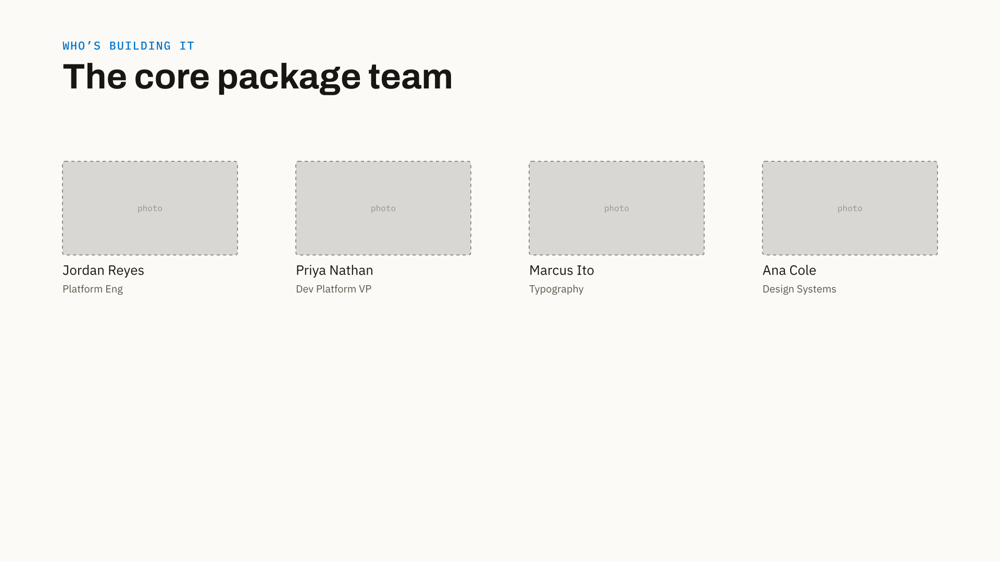
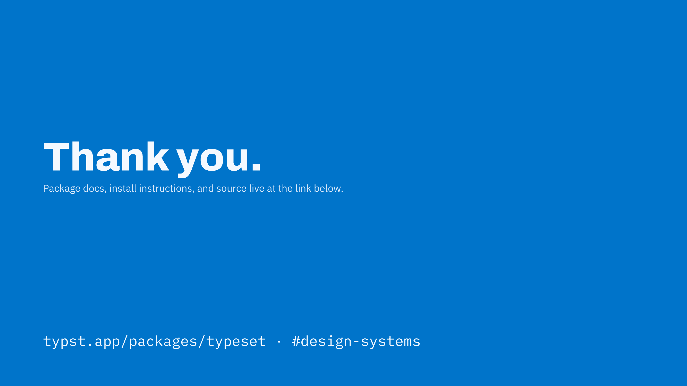

# Slides

Source: `src/slide.typ`. One dispatcher, `slide(kind: "...", ..)[body]`, that fans out to a
private `_<kind>-slide()` function per kind. Unknown or omitted `kind` falls back to `"content"`.
Every kind creates exactly one page (`page(fill: ...)`) with its own background — `deck()` itself
emits no pages, so this is the only place page boundaries are decided.

```typst
#slide(kind: "content", kicker: [...], title: [...])[
  body content goes here
]
```

Every kind except `title` and `closing` accepts `progress:` for a bottom-right "N / total"
marker (`_footer-progress`, `slide.typ:11`).

## `title`



Cover slide: accent bar down the left edge, optional eyebrow (with icon), big display title,
subtitle, byline row along the bottom.

| param | type | notes |
|---|---|---|
| `eyebrow` | content | optional; rendered uppercase, mono, tracked |
| `eyebrow-icon` | string | optional Lucide icon name, shown left of the eyebrow |
| `title` | content | required in practice; `Archivo` 800 at `type-scale.display` |
| `subtitle` | content | optional, muted, capped to 550pt width |
| `byline` | array of content | e.g. `([Name], [Team], [Date])`, rendered as an evenly-gutted row |

```typst
#slide(
  kind: "title",
  eyebrow: [typeset — presentation package],
  eyebrow-icon: "terminal",
  title: [Slides that read like a spec.],
  subtitle: [A Typst template system for corporate updates and developer talks.],
  byline: ([Jordan Reyes], [Platform Engineering], [Jul 2026]),
)
```

## `section`


Full accent-color divider between deck sections.

| param | type | notes |
|---|---|---|
| `label` | content | optional eyebrow, e.g. `[Section 02]` |
| `title` | content | display-sm weight 800, on-accent |
| `blurb` | content | optional, bottom-left, capped to 600pt |
| `progress` | content | e.g. `[02 / 10]` |

## `content` (default)


Kicker + headline + free-form body. This is the workhorse kind — anything not covered by a more
specific kind goes here, with the body built from `numbered-grid()`, `cols()`, or raw Typst
markup.

| param | type | notes |
|---|---|---|
| `kicker` | content | optional |
| `title` | content | `h2` scale, weight 700 |
| body | positional content block | anything — see [components.md](components.md) |

```typst
#slide(kicker: [Why this matters], title: [Three problems the old deck format created])[
  #numbered-grid((
    ([Inconsistent typography], [Every team hand-rolled fonts and spacing.]),
    ([No code-native layout], [Snippets always broke indentation in slideware.]),
  ))
]
```

## `compare`



Two-column card comparison; mark one side `recommended: true` for the accent-tinted treatment.

| param | type | notes |
|---|---|---|
| `kicker`, `title` | content | same as `content` |
| `left`, `right` | dict | `(label:, title:, items:, recommended:)` — `items` is an array of content lines |

```typst
#slide(
  kind: "compare",
  kicker: [Data model tradeoffs],
  title: [Documents vs. rows: what actually changes],
  left: (
    label: [Relational],
    title: [Tables + foreign keys],
    items: ([Fixed schema, enforced by the database], [Joins across normalized tables]),
  ),
  right: (
    label: [MongoDB — when it fits],
    title: [Documents + embedding],
    items: ([Schema enforced by the app, or optionally by JSON Schema validators], [Related data embedded; joins via \$lookup when you need them]),
    recommended: true,
  ),
)
```

## `stat`


Navy background, oversized hero number (`type-scale.stat`, 170pt).

| param | type | notes |
|---|---|---|
| `kicker` | content | on-navy-accent |
| `value` | content | the big number/word, e.g. `[6x]` |
| `caption` | content | sits beside the value, capped to 260pt |
| `note` | content | optional footnote, bottom-left, capped to 500pt |

## `image`



Full-bleed image or placeholder with a pinned bottom-left caption bar (navy block over the image).

| param | type | notes |
|---|---|---|
| `image` | content | any content — an `image()` call or a placeholder `rect`/`box` |
| `caption-title` | content | bold, in the caption bar |
| `caption-body` | content | optional, muted, same bar |

## `code`



Navy (or `theme: "light"`) background, kicker+icon, headline, line-numbered syntax-colored code
block. Delegates the block itself to `code-block()` — see [components.md](components.md) for the
`highlight:`/`lang:` behavior.

| param | type | notes |
|---|---|---|
| `kicker`, `kicker-icon` | content / string | optional |
| `title` | content | literal 30pt (one-off, not a named token) |
| `code` | string or `raw` block | see `code-block()` |
| `lang` | string | overrides a `raw` block's own fence language |
| `theme` | `"dark"` (default) or `"light"` | flips background + all text/border colors |
| `highlight` | array | line numbers / inclusive ranges to tint, e.g. `(3, (5, 7))` |

```typst
#slide(
  kind: "code",
  kicker: [Querying],
  kicker-icon: "terminal",
  title: [The aggregation pipeline: filter, reshape, group — in one call],
  lang: "js",
  code: "db.orders.aggregate([\n  { \$match: { status: \"paid\" } },\n  { \$group: {\n      _id: \"\$customerId\",\n      total: { \$sum: \"\$amount\" }\n  }},\n  { \$sort: { total: -1 } },\n  { \$limit: 10 }\n])",
)
```

## `diagram`


Navy/light background, kicker+icon, headline, then a centered `diagram()` call. See
[diagram.md](diagram.md) for the full node/edge/routing reference — this slide kind is a thin
wrapper that just forwards `nodes`, `edges`, `cols`, `rows`, `cell`, `gutter`, `table-style`,
`theme` straight to the component.

| param | type | notes |
|---|---|---|
| `kicker`, `kicker-icon` | content / string | optional |
| `title` | content | literal 30pt |
| `nodes`, `edges`, `cols`, `rows`, `cell`, `gutter`, `table-style`, `theme` | — | forwarded verbatim to `diagram()` |

You can also skip this slide kind entirely and call `diagram()` directly inside a `content` slide
body (`examples/demo.typ` does both — see the "workflow variant" and "kind: table nodes"
examples there) when you want diagram + free-form text on the same slide.

## `quote`



Vertically centered pull-quote (accent rule, display-weight quote text, avatar placeholder,
attribution). Thin wrapper over `pull-quote()`.

| param | type | notes |
|---|---|---|
| `quote` | content | `type-scale.quote` (32pt), weight 600 |
| `name`, `role` | content | attribution line |

## `team`



N-up grid of photo-placeholder + name + role cards.

| param | type | notes |
|---|---|---|
| `kicker`, `title` | content | optional |
| `members` | array of dict | `(name:, role:)` per person |
| `columns` | int | default 4 |

## `closing`



Mirrors `title` on an accent background — no `progress` marker (matches `title`).

| param | type | notes |
|---|---|---|
| `title` | content | display-sm, weight 800, on-accent |
| `subtitle` | content | optional, on-accent-muted |
| `footer` | content | bottom-left, mono |

## Adding a new slide kind

1. Write a private `_<kind>-slide(...)= context { page(fill: t...)[ ... ] }` function in
   `slide.typ`, following the pattern of the existing ones (read `typeset-theme.get()`, pick
   `paper`/`navy`/`accent` background, use `pad(x: spacing.page-x, y: spacing.page-y)` for the
   standard margin, call `_footer-progress(progress, ...)` if it should support a progress
   marker).
2. Add an `else if kind == "..."` branch in the `slide()` dispatcher at the bottom of the file.
3. Add one example to `examples/demo.typ` (keep it in mockup order — see
   [index.md](index.md#how-the-package-fits-together)) and document it in this file.
4. Compile-check and visually re-render — see
   [getting-started.md](getting-started.md#gotchas) for why a compiler-clean result isn't enough.
